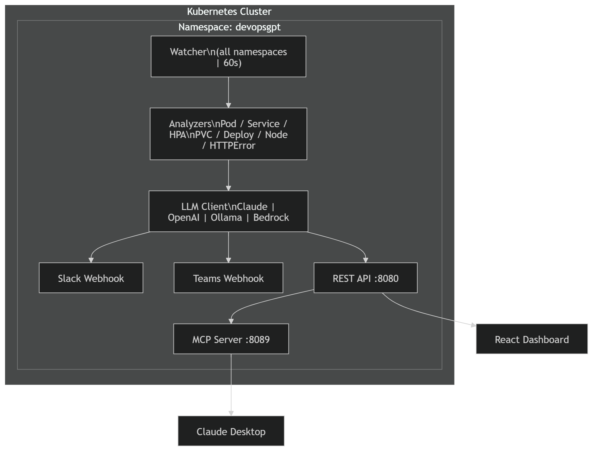

# DevOpsGPT

> Kubernetes AI Operator — monitora todas as namespaces, detecta erros HTTP em tempo real, analisa com LLM e notifica Slack/Teams automaticamente.



---

## O que é

DevOpsGPT é um operador Kubernetes escrito em Go, inspirado no [K8sGPT](https://k8sgpt.ai) (CNCF Sandbox), mas construído do zero com suporte a múltiplos backends de LLM, auto-remediation e integração nativa com Slack, Teams e Claude Desktop via MCP.

Diferente do K8sGPT que roda via CLI, o DevOpsGPT **vive dentro do cluster** como um pod com acesso RBAC somente-leitura em todas as namespaces, rodando continuamente e agindo como um SRE especialista 24/7.

---

## Features

- **All-namespace monitoring** — escaneia todos os namespaces automaticamente a cada intervalo configurável
- **HTTP error detection** — detecta `401`, `404`, `500`, `503`, timeouts e connection resets nos logs dos pods
- **Multi-LLM** — suporte a Claude, Ollama (local), OpenAI e AWS Bedrock via interface unificada
- **SRE system prompt** — fonte única em `pkg/prompt`, análise estruturada com causa raiz, ação imediata, fix permanente e prevenção
- **Slack + Teams** — notificações simultâneas com retry/backoff, Adaptive Cards e formatação de severidade
- **Auto-remediation** — engine com risk threshold configurável (`low/medium/high`), dry-run por padrão
- **REST API** — compatível com o formato do K8sGPT (`POST /v1/analyze`), autenticação via Bearer token e CORS configurável
- **MCP Server** — integração com Claude Desktop, com SRE prompt enviado automaticamente no handshake e `get_pod_logs` com logs reais
- **React Dashboard** — frontend dark mode com aba de providers, watcher automático e viewer do SRE prompt
- **Prometheus metrics** — `/metrics` com contagem de issues, latência do LLM, notificações e remediações
- **Resiliência** — mutex em todas as operações concorrentes, retry com backoff exponencial, timeout de 30s no LLM, cache limitado a 500 resultados

---

## Estrutura do projeto

```
devopsgpt/
├── cmd/
│   └── devopsgpt/
│       ├── main.go                  # Entry point — orquestra todos os componentes
│       └── config.go                # Leitura de variáveis de ambiente
├── pkg/
│   ├── analyzer/
│   │   └── analyzer.go              # Pod, Service, HPA, PVC, Deployment, Node, HTTPError
│   ├── llm/
│   │   └── client.go                # Claude, Ollama, OpenAI, Bedrock (interface unificada)
│   ├── prompt/
│   │   └── prompt.go                # Fonte única do SRE system prompt
│   ├── metrics/
│   │   └── metrics.go               # Prometheus metrics (issues, LLM, notify, remediation)
│   ├── watcher/
│   │   └── watcher.go               # Watch loop + mutex + retry + LLM timeout
│   ├── notify/
│   │   └── notifier.go              # Slack + Teams com retry/backoff e zap logger
│   ├── remediation/
│   │   └── remediation.go           # Auto-fix com risk threshold
│   ├── mcp/
│   │   └── server.go                # MCP Server JSON-RPC 2.0 (:8089) + pod logs reais
│   └── server/
│       └── server.go                # REST API (:8080) + auth + CORS + /metrics
├── dashboard/
│   ├── Dashboard.jsx                # React frontend (Vite)
│   ├── main.jsx                     # Entry point React
│   ├── index.html                   # HTML base
│   ├── vite.config.js               # Vite config com proxy para API
│   ├── package.json
│   └── Dockerfile                   # Build + preview estático
├── deploy/
│   └── manifests.yaml               # Namespace, RBAC, Secret, ConfigMap, Deployment, SVC, HPA
├── Dockerfile                       # Multi-stage, distroless
├── docker-compose.yml               # Sobe devopsgpt + dashboard juntos
├── .env.example                     # Template de variáveis (copiar para .env)
├── go.mod
└── README.md
```

---

## Quickstart local (Docker Compose)

### 1. Clonar e configurar

```bash
git clone https://github.com/yagothadeu25/DevOpsGPT-ai.git
cd DevOpsGPT-ai

cp .env.example .env
vim .env  # preencher ANTHROPIC_API_KEY e webhooks
```

### 2. Configurar kubeconfig

O DevOpsGPT precisa acessar o cluster a partir do container. Crie um kubeconfig com `host.docker.internal` no lugar de `127.0.0.1`:

```bash
cp ~/.kube/config .kube-config
sed -i 's|https://127.0.0.1:<porta>|https://host.docker.internal:<porta>|g' .kube-config
# Desabilitar verificação TLS (ambiente local):
sed -i 's|certificate-authority-data:.*|insecure-skip-tls-verify: true|g' .kube-config
```

### 3. Subir

```bash
docker compose up --build
```

| Serviço | URL |
|---|---|
| Dashboard | http://localhost:3000 |
| REST API | http://localhost:8080 |
| MCP Server | http://localhost:8089 |

### 4. Verificar

```bash
curl http://localhost:8080/healthz
curl http://localhost:8080/v1/results | jq
```

---

## Deploy no Kubernetes

### 1. Preencher secrets

```bash
vim deploy/manifests.yaml  # seção Secret
```

```yaml
stringData:
  ANTHROPIC_API_KEY: "sk-ant-..."
  SLACK_WEBHOOK_URL:  "https://hooks.slack.com/services/..."
  TEAMS_WEBHOOK_URL:  "https://..."
```

### 2. Aplicar

```bash
kubectl apply -f deploy/manifests.yaml
kubectl get pods -n devopsgpt -w
```

### 3. Build e push da imagem

```bash
docker build -t yagothadeu25/devopsgpt:latest .
docker push yagothadeu25/devopsgpt:latest
kubectl rollout restart deploy/devopsgpt -n devopsgpt
```

---

## Analyzers disponíveis

| Analyzer | O que detecta |
|---|---|
| `PodAnalyzer` | CrashLoopBackOff, OOMKilled |
| `HTTPErrorAnalyzer` | 401, 404, 500, 503, timeout, ECONNREFUSED nos logs |
| `ServiceAnalyzer` | Services sem endpoints |
| `HPAAnalyzer` | HPAs incapazes de escalar |
| `PVCAnalyzer` | PVCs em estado Pending |
| `DeploymentAnalyzer` | Deployments com réplicas indisponíveis |
| `NodeAnalyzer` | Condições anormais nos nodes |

---

## LLM Backends

| Provider | Config | Local | Requer key |
|---|---|---|---|
| Claude (Anthropic) | `LLM_PROVIDER=claude` | ❌ | ✅ |
| Ollama | `LLM_PROVIDER=ollama` | ✅ | ❌ |
| OpenAI | `LLM_PROVIDER=openai` | ❌ | ✅ |
| AWS Bedrock | `LLM_PROVIDER=bedrock` | ❌ | IAM Role |

Para ambientes com requisitos de compliance (PCI-DSS, SOC2), recomenda-se Ollama com Llama 3 — zero dado sensível sai do cluster.

---

## Variáveis de ambiente

| Variável | Default | Descrição |
|---|---|---|
| `LLM_PROVIDER` | `claude` | `claude / ollama / openai / bedrock` |
| `LLM_MODEL` | `claude-3-5-sonnet-20241022` | Modelo a usar |
| `LLM_BASE_URL` | — | Base URL customizada (Ollama: `http://ollama:11434`) |
| `POLL_INTERVAL` | `60s` | Intervalo entre scans |
| `AUTO_REMEDIATE` | `false` | Habilitar auto-correção |
| `RISK_THRESHOLD` | `low` | Risco máximo aceito: `low / medium / high` |
| `DRY_RUN` | `true` | Simular sem aplicar comandos |
| `API_PORT` | `8080` | Porta REST API |
| `MCP_PORT` | `8089` | Porta MCP Server |
| `SLACK_WEBHOOK_URL` | — | Webhook Slack |
| `TEAMS_WEBHOOK_URL` | — | Webhook Microsoft Teams |
| `API_TOKEN` | — | Bearer token para proteger a REST API (opcional) |
| `ALLOW_ORIGIN` | `http://localhost:3000` | CORS origin permitida |

---

## REST API

| Método | Endpoint | Descrição |
|---|---|---|
| `GET` | `/healthz` | Health check |
| `GET` | `/readyz` | Readiness probe |
| `GET` | `/metrics` | Prometheus metrics |
| `GET` | `/v1/results` | Todos os issues com AI analysis |
| `POST` | `/v1/analyze` | Trigger análise (compatível com K8sGPT) |
| `GET` | `/v1/summary` | Saúde por namespace |
| `GET` | `/v1/providers` | Providers LLM disponíveis |
| `GET` | `/v1/prompt` | SRE system prompt atual |

> Endpoints `/v1/*` requerem `Authorization: Bearer <API_TOKEN>` quando `API_TOKEN` está configurado.

---

## MCP Server — Claude Desktop

O MCP Server expõe 5 tools para o Claude Desktop:

| Tool | Descrição |
|---|---|
| `get_cluster_issues` | Issues atuais com filtro por severity e namespace |
| `get_namespace_summary` | Saúde resumida por namespace |
| `get_pod_logs` | Logs recentes de um pod específico |
| `analyze_issue` | Deep-dive em um issue por ID |
| `get_sre_prompt` | Retorna o SRE system prompt |

### Configuração

```json
// ~/.config/claude/claude_desktop_config.json
{
  "mcpServers": {
    "devopsgpt": {
      "url": "http://localhost:8089/mcp"
    }
  }
}
```

---

## Auto-remediation

O engine de auto-remediation aplica comandos `kubectl` gerados pelo LLM, com as seguintes salvaguardas:

- Somente comandos iniciados com `kubectl` são aceitos
- Comandos destrutivos (`delete namespace`, `delete node`, `delete pv`) são bloqueados
- `RISK_THRESHOLD` controla o risco máximo aceito (`low / medium / high`)
- `DRY_RUN=true` (padrão) apenas loga o comando sem executar

```yaml
AUTO_REMEDIATE: "true"
RISK_THRESHOLD: "low"
DRY_RUN: "false"
```

---

## SRE System Prompt

O prompt padrão instrui o DevOpsGPT a responder sempre no formato:

```
🔴 SEVERITY: critical/error/warning/info
🎯 ROOT CAUSE: causa raiz concisa
⚡ IMMEDIATE ACTION: kubectl commands prontos
🔧 PERMANENT FIX: passos de correção
🛡️ PREVENTION: o que adicionar/mudar
```

Editável via aba **SRE Prompt** no dashboard ou via `GET /v1/prompt`.

---

## RBAC

O DevOpsGPT usa um `ClusterRole` com permissões **somente-leitura** em todos os recursos, exceto:

- `deployments` — `patch/update` (rollback)
- `pods` — `delete` (restart)

Nenhuma permissão de escrita em `secrets`, `namespaces`, `nodes` ou `persistentvolumes`.

---

## Roadmap

- [ ] Webhook receiver para eventos do Kubernetes (sem polling)
- [ ] Integração com Prometheus AlertManager
- [ ] PagerDuty / OpsGenie notifier
- [ ] UI de histórico de incidents
- [ ] Fine-tuning de modelo próprio com dados do cluster
- [ ] Helm chart

---

## Créditos

Inspirado no [K8sGPT](https://k8sgpt.ai) — projeto CNCF Sandbox.

Construído por [Yago Martins](https://desvsecops.com/blog) — DevSecOps/SRE Specialist.

---

*desvsecops.com/blog*
